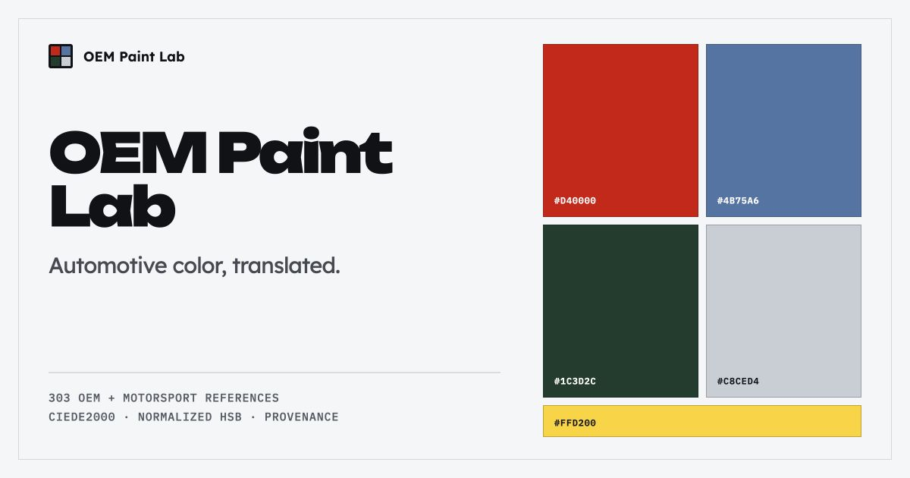

# OEM Paint Lab

> An independent automotive color-reference and analysis tool built around a 303-record archive.



**Live product:** [https://paintlab.bennettspeir.com/](https://paintlab.bennettspeir.com/)

## What it is

OEM Paint Lab is an independently built reference and analysis product for exploring automotive colors as structured digital data. It combines an archive browser with conversion, comparison, and local color-workspace tools. Its current archive contains 303 records across three collections:

- 264 OEM records
- 38 Motorsport records
- 1 Other record

The archive values are digital sRGB references intended for on-screen comparison and analysis. They are not physical paint specifications, measured pigment formulas, or claims of official manufacturer accuracy.

## Core capabilities

- **Library and Paint Detail:** Search and filter the archive, inspect its taxonomy and record metadata, review provenance, and generate a copyable correction report.
- **Lab and Finish Lab:** Enter a HEX color, inspect RGB and HSB/HSV representations, find perceptually similar archive records, and explore heuristic finish relationships.
- **Compare:** Place archive or custom colors side by side and calculate their perceptual distance with CIEDE2000.
- **My Colors:** Save archive records and create personal colors that remain on the current browser and device.
- **Provenance:** Distinguish Reference and Estimated values while retaining record-level source links when available.

## Data and provenance

Each archive record has a stable numeric ID that is preserved across releases. Provenance describes how its digital value was obtained:

- **Reference** means a digital HEX value was explicitly stated by a source or supplied directly by the user.
- **Estimated** means the digital value was derived from photography, descriptive evidence, paint-code cross-referencing, or another interpretive process.

Source links identify where references were encountered. Attribution does not imply ownership, endorsement, affiliation, or official verification by a manufacturer or other named organization. Unsupported fields are left unknown rather than inferred.

A screen color cannot reproduce physical pigment, metallic flake, pearl behavior, substrate, clear-coat depth, lighting, viewing angle, or finish. Even a well-sourced HEX value should therefore be treated as a digital reference rather than a physical match.

See [Third-party notices](./THIRD_PARTY_NOTICES.md) for applicable source attribution.

## Technology

- React
- TypeScript
- Vite
- XLSX-to-JSON import and validation
- sRGB-to-CIELAB conversion and CIEDE2000 color difference
- Browser `localStorage` for My Colors

## Run locally

The current Vite toolchain requires Node.js `^20.19.0` or `>=22.12.0` and npm. Install the locked dependencies and start the development server:

```bash
npm ci
npm run dev
```

No private environment variables are required for the current application.

## Validation and production build

Validate the generated paint archive:

```bash
npm run validate:paints
```

This checks record integrity, stable and unique IDs, canonical HEX syntax, provenance and collection classifications, expected archive totals, and required generated-data fields.

Run the TypeScript check and create the Vite production build:

```bash
npm run build
```

## Data pipeline

```text
XLSX workbook → normalization → validation → generated JSON → product views
```

The XLSX workbook is the canonical structured source for the archive. The importer reads and normalizes workbook values, validates the expected record structure and identifiers, and writes deterministic generated JSON. Product views consume that shared validated source of truth rather than maintaining separate copies of the archive.

## Known limitations

- Digital references can vary between displays and color-management conditions.
- HEX values are not physical paint specifications.
- Some archive records are interpretive estimates and are explicitly labeled Estimated.
- My Colors is stored only in the current browser and device.
- There is no account system or cloud synchronization.
- Source availability and external links may change over time.

## Source use

© 2026 Bennett Speir. All rights reserved in the original code and other original copyrightable material.

This repository is publicly viewable for inspection and portfolio review. No general license is granted to reuse, modify, redistribute, or commercialize the original code without prior written permission.

This notice does not limit rights granted under GitHub’s Terms of Service, applicable law, or third-party licenses. Third-party materials remain subject to their respective terms. No ownership of underlying factual color values is claimed.

## Third-party notices

[THIRD\_PARTY\_NOTICES.md](./THIRD_PARTY_NOTICES.md) contains attribution and legal notices for adapted third-party structured data.
